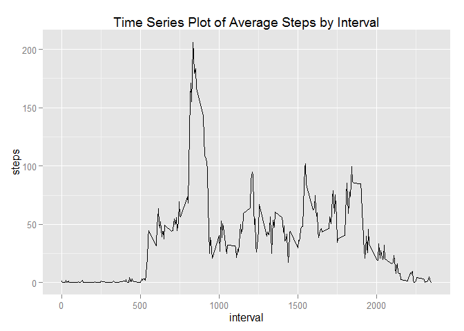

# Reproducible Research: Peer Assessment 1


## Loading and preprocessing the data

Load the data (i.e. read.csv())

```r
data <- read.csv("activity.csv")
```

Process/transform the data (if necessary) into a format suitable for analysis

```r
data$date <- as.Date(data$date)
```

## What is mean total number of steps taken per day?
Make histogram of the total number of steps taken each day

```r
library(ggplot2)
dailysteps <- aggregate(x = data$steps , by = list(data$date), FUN = sum ,na.rm=TRUE)
names(dailysteps) <- c("date","steps")
histplot <- ggplot(dailysteps,aes(x = steps)) +
            ggtitle("Histogram of daily steps") +
            xlab("Daily Number of Steps") +
            geom_histogram(binwidth = 500)
histplot
```

 

mean total number of steps taken per day

```r
mean(dailysteps$steps , na.rm = TRUE)
```

```
## [1] 9354.23
```

median total number of steps taken per day

```r
median(dailysteps$steps , na.rm = TRUE)
```

```
## [1] 10395
```

## What is the average daily activity pattern?
Make Time series plot of 5-minute interval and the average number of steps taken, averaged across all days

```r
intsteps   <- aggregate(x = data$steps , by = list(data$interval), FUN = mean ,na.rm=TRUE)
names(intsteps ) <- c("interval","steps")

avg.step.line <- ggplot(intsteps ,aes(interval,steps)) +
                 ggtitle("Time Series Plot of Average Steps by Interval") +
                 geom_line()
avg.step.line  
```

 

The 5-min time interval contains the maximum number of steps?

```r
intsteps[which.max(intsteps$steps),c("interval")]
```

```
## [1] 835
```
## Imputing missing values

total number of missing values in the dataset

```r
nrow(data[is.na(data$steps),])
```

```
## [1] 2304
```

Replace the missing values with the median value for that interval.

```r
cleanData<-data
cleanData$steps[is.na(cleanData$steps)] <- tapply(cleanData$steps, cleanData$interval, mean, na.rm = TRUE)
```

Make histogram with new dataframe

```r
total.steps.by.day <- aggregate(x = cleanData$steps , by = list(cleanData$date), FUN = sum ,na.rm=TRUE)
names(total.steps.by.day) <- c("date","steps")
histplot <- ggplot(total.steps.by.day,aes(x = steps)) +
            ggtitle("Histogram of daily steps after imputation") +
            xlab("Daily Number of Steps") +
            geom_histogram(binwidth = 500)
histplot 
```

 

mean total number of steps taken per day

```r
mean(total.steps.by.day$steps , na.rm = TRUE)
```

```
## [1] 10766.19
```
median total number of steps taken per day

```r
median(total.steps.by.day$steps , na.rm = TRUE)
```

```
## [1] 10766.19
```
## Are there differences in activity patterns between weekdays and weekends?
Add the Weekday/weekend identifier

```r
cleanData$weekday <- as.factor(ifelse(weekdays(cleanData$date) %in% c("Saturday","Sunday"), "Weekend", "Weekday")) 

average.steps.by.interval.and.weekday  <- aggregate(x = cleanData$steps , 
                                                    by = list(cleanData$interval,cleanData$weekday), FUN = mean ,na.rm=TRUE)
names(average.steps.by.interval.and.weekday) <- c("interval","weekday","steps")
```
panel time series plot of the 5-minute interval and the average number of steps taken 
averaged across all weekday days or weekend days.

```r
avg.step.line <- ggplot(average.steps.by.interval.and.weekday,aes(interval,steps)) +
                 ggtitle("Time Series Plot of Average Steps by Interval after Imputation") +
                 facet_grid(. ~ weekday) +
                 geom_line(size = 1)
avg.step.line  
```

 
